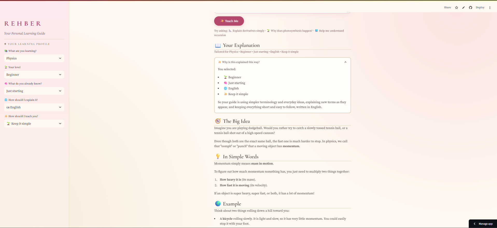
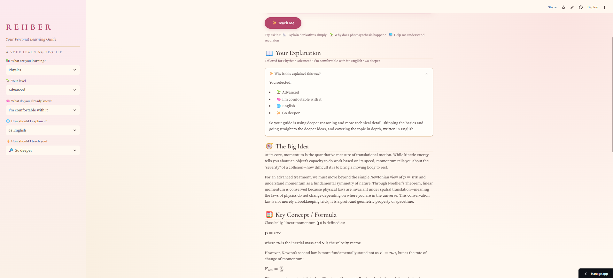

# REHBER

**Your Personal Learning Guide: understand it your way.**

REHBER is a small web app that generates educational explanations tailored to a student's subject, learning level, background knowledge, preferred language, and learning style.

🔗 **Live demo:** https://rehber-j5c97qvawnjz8pnm7g2gke.streamlit.app/

## The idea

Instead of Question → AI → Generic Answer, REHBER does:

**Student context + Question → Personalized explanation**

The same question produces meaningfully different explanations when the learner's profile changes.

## Screenshots

| Beginner, keep it simple | Advanced, go deeper |
|---|---|
|  |  |

## How it works

1. The learner picks a subject, level, background knowledge, language (English, Urdu, or Turkish), and teaching style.
2. They type a question and click **Teach Me**.
3. The app checks the question, builds a structured tutoring prompt from the profile and question, and sends it to a Gemini model through the Google GenAI API.
4. The response is shown as a short lesson, with a line showing how it was tailored and a "Why is this explained this way?" note.

## Tech stack

- Python
- Streamlit
- Google Gemini API (`google-genai`)
- Git and GitHub
- Streamlit Community Cloud

## Run it locally

```bash
git clone https://github.com/AyeshaMunir19/rehber.git
cd rehber
python -m venv venv
venv\Scripts\activate
pip install -r requirements.txt
```

Create a file at `.streamlit/secrets.toml` containing:

```toml
GEMINI_API_KEY = "your-key-here"
```

Then run:

```bash
streamlit run app.py
```

## Security

The API key is never stored in the code. It is read from Streamlit secrets, and `.streamlit/secrets.toml` is excluded from Git.

## Limitations

- Explanations are generated by a language model and can contain mistakes, so important facts should be double-checked.
- The app has no accounts, history, quizzes, or progress tracking. It is intentionally focused on one feature: personalized explanations.
- The free API tier can be busy at times, so the app retries and falls back to other models.

## Ideas for later

Saving favorite explanations, more subjects, and more languages.